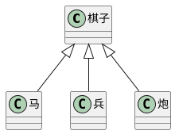

# 深入理解类和接口

## 面向对象概述

面向对象：Oriented（基于） Object（事物）

## 类的继承

## 继承的作用

继承可以描述类与类之间的关系

通过继承子类自动拥有父类的所有成员

## 成员的重写

重写（overwrite）：子类中覆盖父类的成员。

在继承的关系中，子类成员不能改变父类成员的类型。

无论是属性还是方法，子类都可以对父类的相应成员进行重写，但是重写时，需要保证类型的匹配。

注意this关键字：在继承关系中，this的指向是动态的，调用方法时，根据具体的调用者确认this指向。

super关键字：在子类的方法中，可以使用super关键字读取父类成员，大多数情况下和this类似，但是如果父类、子类有想同的属性或方法时，super和this就有区别了。

## 类型匹配

还是鸭子辨型法，子类的对象，始终可以赋值给父类，

面向对象中，这种现象，叫做里氏替换原则。

如果需要判断一个数据的具体子类类型，可以使用instanceof。

## protected修饰符

之前学了只读、访问权限修饰符，readonly、private、public

protected：受保护的成员，只能在自身和子类中访问。

## 继承的单根性和传递性

单根性：每个类最多只能拥有一个父类。

传递性：如果A是B的父类，并且B是C的父类，则也可以认为A也是C的父类。

## 抽象类

## 为什么需要抽象类



将类抽象出来，而让这个抽象的类不能被new生成实例。
有时，某个类只表示一个抽象概念，主要用于提取子类共有的成员。而不能直接创建它的实例对象。则该类可以作为抽象类。

给类前面加上'abstract'，表示该类是一个抽象类，不可以创建一个抽象类的对象。

## 抽象成员

父类中，可能知道有些成员是必须存在的，但是不知道该成员的值或实现是什么，因此，需要有一种强约束，让继承该类的子类，必须要实现该成员。

抽象类中，可以有抽象成员，这些抽象成员必须在子类中实现。给类中的成员前面加上'abstract'，表示该成员是个抽象成员。

## 设计模式 - 模板模式

设计模式：面对一些常见的功能场景时，有一些固定的、经过多年实践的成熟方法，这些方法称之为设计模式。

模板模式：有些方法，所有的子类实现的流程完全一致，只是流程中某个步骤的具体实现不一致，则可以将该方法提取到父类，在父类中完成整个流程的实现，遇到实现不一致的方法时，将该方法做成抽象方法。

## 小结

在抽象类中使用了抽象成员，当我们继承这个抽象类时，就能得到提示，告诉我们需要强制设置哪些成员或方法。这是一个强约束，使我们在实际开发时，节省很多时间，提升很多效率。

## 静态成员

静态成员是指，附着在类上的成员（在JS中描述为属于某个构造函数的成员）。

使用static修饰的成员，是静态成员

实例成员：对象成员，属于某个类的对象

静态成员：非实例成员，属于某个类

## 静态方法中的this

实例方法中的this指向的是**当前对象**

而静态方法中的this指向的是**当前类**

## 设计模式 - 单例模式

单例模式:某些类的对象,在系统中最多只能有一个,为了避免开发者造成随意创建多个类对象的

错误,可以使用单例模式进行强约束

## 再谈接口

接口用于约束类、对象、函数，是一个类型契约。

对于函数，不使用接口时：

- 对成员函数没有强约束力
- 容易将类型和成员函数耦合在一起

以上问题总结就是，系统中缺失了对成员函数的定义　－－接口
在面向对象领域中的接口的语义：表达了某个类是否拥有某个成员函数

某个类具有某个成员函数，其实，就是实现了某个接口。

## 类型保护函数

帮助判断某个对象是否拥有某个成员函数，在运行的过程中检查。
通过调用该函数，可以触发TS的类型保护，该函数必须返回布尔值。

接口和类型别名的最大区别：接口可以被类实现，而类型别名不可以。

> 接口可以继承类,表示该类的所有成员都在接口中

## 索引器

```对象[值]```,这种格式就叫索引器，以前我们叫做：使用成员表达式。
在TS中，默认情况下，不对索引器（成员表达式）做严格的类型检查
例如这种形式：```u1["pid"]```,u1中即使没有pid属性，也不会报错。
因为我们采取这种写法时，是说明索引器中的可能是个变量，所以检查比较宽松。

使用配置```noImplicitAny```开启对隐式any的检查。

隐式any：TS根据实际情况推导出的any类型

在索引器中，键的类型可以是字符串，也可以是数字

在类中，索引器的书写位置应该是所有成员之前

索引器的作用：

- 在严格的检查下，可以实现为类动态增加成员
- 可以实现动态的操作类成员

在JS中所有的成员名，本质上都是字符串，如果使用数字作为成员名会自动转换成字符串。
一道题目：
const arr = []
arr[0] = 1;
arr["0"] = 3;
console.log(arr[0]);

## this指向约束

## 在JS中this指向的几种情况

明确：大部分时候，this的指向取决于函数的调用方式，谁调用就指向谁

- 如果直接调用函数（全局调用），函数的this指向全局对象（window）或undefined（启用严格模式时）
- 如果使用```object.func()```方式调用时，this则指向对象本身
- 如果是dom事件的处理函数，this指向事件处理对象

特殊情况：

- 箭头函数，this在函数声明时确定指向，this指向函数声明的位置
- 使用bind、apply、call手动绑定this指向

## TS中的this

配置noImplicitThis为true，表示不允许this隐式的指向any。

在TS中，允许在书写函数时，手动声明该函数中this的指向，声明的做法是将this作为函数的第一个参数，并定义指向的变量。该参数只用于约束this，并不是真正的参数，也不会出现在编译结果中。

class UserI {
  constructor(
    public name: string,
    public age: number
  ) { }
  sayHello(this:UserI) {
    console.log(this, this.name, this.age)
  }
}

##　装饰器

## 概述

> 面向对象的概念(java:注解,C#:特征),decorator
> angular大量使用，react中也会用到
> 目前JS支持装饰器，目前处于建议征集的第二阶段

### 解决的问题

装饰器，能够带来分离关注点

- 信息书写位置问题：在定义某个东西时，应该最清楚该东西的约束情况
- 重复代码的问题

上述两个问题产生的根源：某些信息，在定义时，能够附加的信息量有限。

装饰器的作用：为某些属性、类、参数、方法提供元数据信息（metadata）。

元数据：描述数据的数据

### 装饰器的本质

在JS中，装饰器是一个函数。（装饰器是要参与运行的）

装饰器可以修饰：

- 类
- 成员（属性 + 方法）
- 参数

## 类装饰器

装饰器的本质是一个函数，该函数接收一个参数，表示类本身（构造函数本身），可以在装饰器里对这个类做出任何想要的操作。

使用装饰器 ```@装饰器名(同时是一个函数)```

在TS中，如何约束一个变量为类

- 将类型约束为Function
- 将类型约束为```new (params) => object```

装饰器函数的运行时间：在类定义后直接运行

类装饰器可以具有的返回值：

- void：仅运行函数
- 返回一个新的类：会将新的类替换掉装饰目标

多个装饰器情况：

装饰器的运行顺序是从下往上运行的，类似于一个栈

## 成员装饰器

- 属性

属性装饰器也是一个函数，该函数需要两个参数：
1.如果是静态属性，则为类本身；如果是实例属性，则为类的原型（prototype）；
2.固定为一个字符串，表示属性名；

- 方法

方法装饰器也是一个函数，该函数需要三个参数：

1.如果是静态方法，则为类本身；如果是实例方法，则为类的原型（prototype）；
2.固定为一个字符串，表示方法名；
3.属性描述对象，类似于defineProperty的描述对象；

## 练习：类和属性的描述装饰器

## reflect-metadata库

该库的作用：专门用来保存元数据

## class-validator库和class-transformer库

plain-object

## 补充

- 参数装饰器

依赖注入、依赖倒置。
要求函数有三个参数：
1.如果方法是静态的，则为类本身；如果方法是实例方法，则为类的原型。
2.方法名称。
3.在参数列表中的索引。

- 关于TS自动注入的元数据

如果安装了```reflect-metadata```，并且导入了该库，并且在某个成员上添加了元数据，并且启用了```emitDecoratorMetadata```。
s
这样一来，TS的类型检查（约束）将有机会在运行时运行。

- 设计模式AOP

编程方式，属于面向对象开发。

将一些在业务中共同出现的功能块，横向切分，以达到分离关注点的目的。

## 类型演算

> 根据已知的信息，计算出新的类型

## 三个关键字

- typeof

TS中的typeof，书写的位置在类型约束的位置上。
表示：获取某个数据的类型。可以让b的类型与a的类型保持一致

当typeof作用于类的时候，得到的类型，是该类的构造函数

- keyof

作用于类、接口、类型别名，用于获取其他类型中的所有成员名组成的联合类型。

- in

该关键字往往和keyof联用，限制某个索引类型的取值范围。

## TS中预设的类型演算

```ts
Partial<T>  // 将类型T中的成员变为一个联合类型

Required<T>  // 将类型T中的成员变为必填，通过 -？ 剔除掉可选参数 

Readonly<T>  // 将类型T中的成员变为只读

Exclude<T, U>  // 从T中剔除可以赋值给U的类型

Extract<T, U>  // 提取T中可以赋值给U的类型

NonNullable<T>  // 从T中剔除null和undefined

ReturnType<T>  // 获取函数返回值类型

InstanceType<T>  // 获取构造函数类型的实例类型

```

##　声明文件

> 概述

1.什么是声明文件？

以.d.ts结尾的文件，就是声明文件

2.声明文件有什么作用？

ts -> js，得不到类型声明。所以声明文件是为JS代码提供类型声明。

当使用第三方库时，我们需要引用它的声明文件，才能获得对应的代码补全、接口提示等功能。

3.声明文件书写的位置？

- 放置到tsconfig.json配置中包含的目录中。
- 放置到node_modules/@types文件夹中。
- 手动配置声明文件所在位置。
- 与JS代码所在目录相同，并且文件名也相同的文件。用TS代码书写的工程发布之后的格式。

> 编写

- 自动生成

工程使用ts来开发的，发布（编译）之后，是js文件，发布的是js文件。

如果发布的文件，需要其他开发者使用，可以使用声明文件，来描述发布结果中的类型。

配置```tsconfig.json```中的```declaration:true```即可，ts就会为发布的结果自动生成声明文件。

- 手动编写

1.对已有的库，它是使用js书写而成，并且更改该库的代码为ts成本较高，可以手动编写声明文件。

2.对一些第三方库，他们使用js书写而成，并且这些第三方库没有提供声明文件，我们可以手动编写声明文件。

**全局声明**

声明一些全局的对象、属性、变量

新语法索引:

- declare var 声明全局变量
- declare function 声明全局方法
- declare class 声明全局类
- declare enum 声明全局枚举类型
- declare namespace 声明（含有子属性的）全局对象
- interface 和 type 声明全局类型
- export 导出变量
- export namespace 导出（含有子属性的）对象
- export default ES6 默认导出
- export = commonjs 导出模块
- export as namespace UMD 库声明全局变量
- declare global 扩展全局变量
- declare module 扩展模块
- /// <reference /> 三斜线指令

**模块声明**

使用```declare module```语法，命名一个模块，在其内部我们依然正常的使用声明语法。

**三斜线指令**

在一个声明文件中，包含另一个声明文件，主要用于联合文件。现在用处不多了。
主要是在用于指定其它声明文件的路径。
语法：
``` /// <reference path="../../index.d.ts" /> ```

> 发布

1.当前工程使用ts开发

编译完成后，将编译结果所在文件夹直接发布到npm上即可。

2.为其他第三方库开发的声明文件

发布到@types/**中。

1）进入github的开源项目DefintelyTyped

2）fork到自己的开源库中

3）从自己的开源库中克隆到本地

4）本地新建分支（例如：mylodash4.3），在新分支中进行声明文件的开发。在types目录中新建文件夹，在新的文件夹中进行开发声明文件。

5）push分支到你的开源库

6）到官方的开源库中，提交pull request

7）等待官方管理员审核（1天），审核通过之后，会将你的分支代码合并到主分支，然后发布到npm。之后，就可以通过命令```npm install @types/你发布的库名。